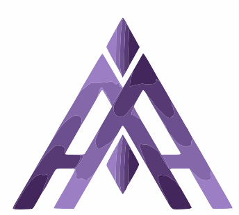

# 💫 About Me:
Hi, I'm Aasish Aspiring Software Engineer  Dedicated Computer Science student with a strong focus on ethics and self-improvement. Experienced in developing AI/ML and IoT solutions, with a focus on resilient, high-quality code.  

## 🌐 Socials:
  

# 💻 Tech Stack:
                                                     
# 📊 GitHub Stats:
 
 

## 🏆 GitHub Trophies

### ✍️ Random Dev Quote

---

